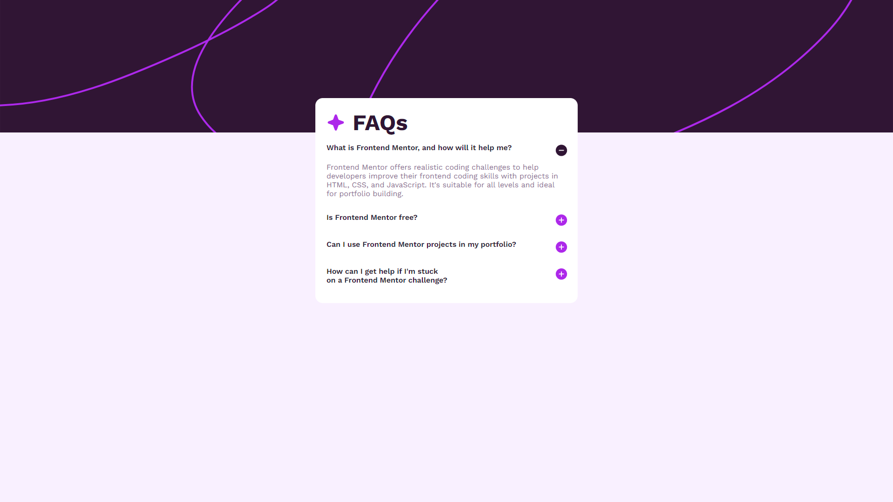

# Frontend Mentor - FAQ accordion solution

This is a solution to the [FAQ accordion challenge on Frontend Mentor](https://www.frontendmentor.io/challenges/faq-accordion-wyfFdeBwBz). Frontend Mentor challenges help you improve your coding skills by building realistic projects. 

## Table of contents

- [Overview](#overview)
  - [The challenge](#the-challenge)
  - [Screenshot](#screenshot)
  - [Links](#links)
- [My process](#my-process)
  - [Built with](#built-with)
  - [Continued development](#continued-development)
  - [Useful resources](#useful-resources)
- [Author](#author)

## Overview

### The challenge

Users should be able to:

- Hide/Show the answer to a question when the question is clicked
- Navigate the questions and hide/show answers using keyboard navigation alone
- View the optimal layout for the interface depending on their device's screen size
- See hover and focus states for all interactive elements on the page

### Screenshot

### Links

- [Solution URL](https://github.com/joelsalmeida/ng-faq-accordion)
- [Live Site URL](https://ng-faq-accordion.vercel.app/)

## My process

As my first project with Angular, my goal was to understand and practice the basic concepts. (Components, interpolation, directives...) I really enjoyed working with the "angular cli", in addition to making the work easier, it helps a lot when applying patterns to the project.

### Built with

- [Angular](https://angular.dev/) - Angular Framework
- [Sass](https://sass-lang.com/) - Syntactically Awesome Style Sheets

### Continued development

Continue learning about the framework and working on more complex projects. In the future, I want to build a full-stack application together with NestJs.

### Useful resources

- [How to Deploy an Angular Site with Vercel](https://vercel.com/guides/deploying-angular-with-vercel) 

## Author

- GitHub - [@joelsalmeida](https://github.com/joelsalmeida)
- Frontend Mentor - [@joelsalmeida](https://www.frontendmentor.io/profile/joelsalmeida)

